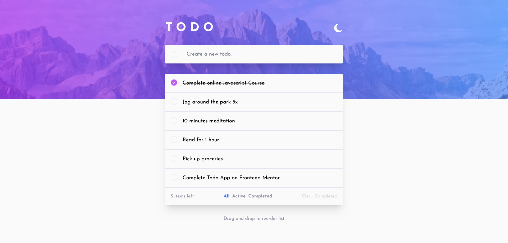
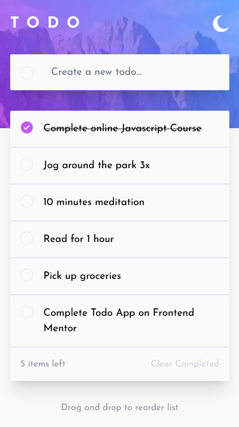

# Frontend Mentor - Todo app solution

This is a solution to the [Todo app challenge on Frontend Mentor](https://www.frontendmentor.io/challenges/todo-app-Su1_KokOW). Frontend Mentor challenges help you improve your coding skills by building realistic projects.

## Table of contents

- [Overview](#overview)
  - [The challenge](#the-challenge)
  - [Screenshot](#screenshot)
  - [Links](#links)
- [My process](#my-process)
  - [Built with](#built-with)
- [Author](#author)

## Overview

### The challenge

Users should be able to:

- View the optimal layout for the app depending on their device's screen size
- See hover states for all interactive elements on the page
- Add new todos to the list
- Mark todos as complete
- Delete todos from the list
- Filter by all/active/complete todos
- Clear all completed todos
- Toggle light and dark mode
- **Bonus**: Drag and drop to reorder items on the list

### Screenshot

### Links

- Solution URL: [Solution URL](https://www.frontendmentor.io/solutions/responsive-todo-app-with-react-tailwindcss-and-redux-toolkit-2PZ-GywKfM)
- Live Site URL: [Live site URL](https://frontendmentor-todo-eight.vercel.app/)

## My process

### Built with

- Flexbox
- Mobile-first workflow
- [React](https://reactjs.org/) - JS library
- [TailwindCSS](https://tailwindcss.com/) - CSS framework
- [HeadlessUI](https://headlessui.com/) - UI components
- [FramerMotion](https://www.framer.com/motion/) - React animation library
- [ReduxToolkit](https://redux-toolkit.js.org/) - State Management library

## Author

- Frontend Mentor - [@f1x3d49](https://www.frontendmentor.io/profile/f1x3d49)
